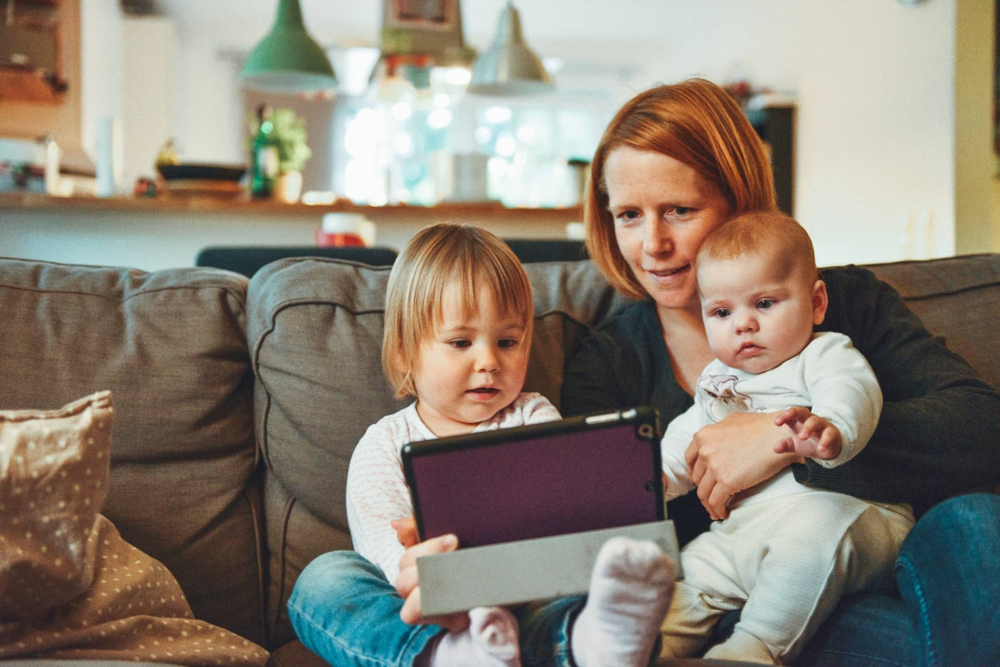

> **Every day we are moving one step ahead in technological advancement and modernization. Today, we are equipped with lots of accessories for our betterment and for saving our time. For every task, we have to do, we fortunately, have time-saving tools. Although it sounds pretty much easier for us to access all sort of accessories, on the other hand, there is a crucial part also.**

> What comes first in your mind when you hear the word “Modern Parents”?

Maybe, your imagination will be of a father who is very broad minded or a mother who doesn’t restrict her child to play outside, isn’t it?. But I am talking about the modern parents from a broader perspective, that is the actual parenting of modern parents during the first seven years of their child which we simply term as hypnosis.

> According to Wikipedia, parenting is defined as “ **Parenting** is the process of promoting and supporting the physical, emotionam, social, and intellectual development of a child from infancy to adulthood ”.

> The above picture reveals a deep love and care of the parents for their cute little daughter, But if we see around us we hardly encounter such kind of situation where the parents give quality time to their offspring.

According to me, a modern parent is like a gardener who only waters his plants daily and never care about soil, excess sunlight, pests and so on. It may sound ridiculous but if we compare the situation of the gardener to that of a modern parent it is close enough. Just as the gardener, the modern parents only concern whether their child is having all the materialistic necessity in their childhood and never care whether their child is learning manners, etiquette, humanity, obedience .etc.

In the present scenario, it is really hard to accept that in India I see that the moment a child reaches 2–3 years he is sent to school, not with the intention of parent that their child will learn thing but with a mean intention that they will be free from their child for an interval of time. The other reason for such early admission of the Indian child is maintaining status in the society. They wonder like “yo... their child has been admitted to “xyz” school today so Honey, tomorrow we will also admit our child”. This is really a very cheap mentality of our society, we should think of the country “Finland” where a child can only be admitted to a school only if he is seven years and you will be surprised to know that Finland is the only country which gives most scientist to the world. In our country, if parents want, they can even start sending their child school right from the next day of their birth. This is the reason why Indian child lacks in creativity because when they are supposed to live freely they are hindered by the homework of school.

> If you are thinking that going to school for small children also make them learning new things, becoming creative, or more, then you may be right, but unfortunately, the ratio is like 20:1.

We are all familiar with the nature of children that they learn anything through imitation, so it’s the duty of the parents to do correct things and behave politely in front of them, but unfortunately we have become so careless that we don’t even think for a while that how fatal our act can be for our children. The so called modern parents are so hypocritical that despite of spending quality time with their children they either give them smartphone, or gaming console just in order to feel free from them.

> Is that the duty of parents ? No, never.

I know the modern world is a busy world and every second is very important for everyone , but that doesn’t give you the right to just produce your child and not provide them proper parenting and not teaching them good etiquette.

When I was a child I used to do a lot of things during my free time like drawing, making electronic gadgets, exploring electric gadgets by breaking them, isn’t that funny, but really I was having some hobby and my friends were also having because these were the thing that let us to think out of the box. But when I look at the current generation I notice every child is either busy in playing games or in watching cartoons, and the parents also don’t care that these things are making their child a buffoon.

Another crucial part in India is we people always try to maintain a good status in the society and I thing while doing this most people cross every limit of hypocrisy just to maintain a good status in the society. If the neighbor started sending their child after his/her second birthday the next very day the other neighbor will admit their child in a even better school. Reason ?

> Just to maintain a good status in the society.

These things should be avoided at any cost, I literally don’t understand why they imitate others act without understanding their children first. Without understanding the potential, without concerning about the health of their child they just send them to far away school just because the neighbor’s child also go there.

> This is where the cross the limit of hypocrisy.

The parents should give first priority to their children, should teach them good etiquette, should spend quality time with them and most importantly should understand them first. Teach them to be a good human beings first rather than just teaching them how to be the topper of their class. These are the only thing that literally make them a “Modern Parents”.

-Mobashir Farhan
