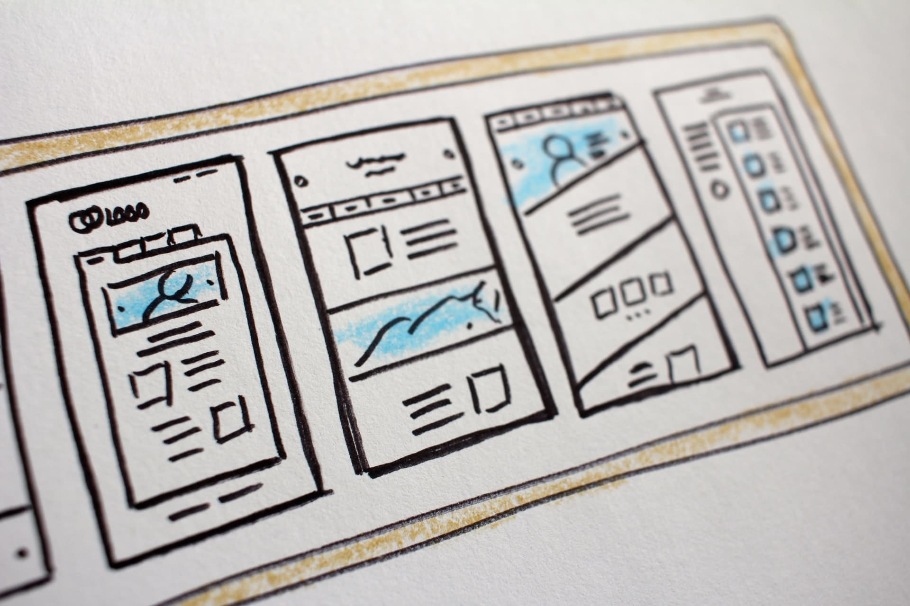

# Writing code for your HTML file is surprisingly not that much hard. However, when it comes to set the layout of your page then the real struggle starts.

> In this blog we will be exploring the CSS-Flex-box and will learn how to design a responsive layout for our webpage.

Flex-box or flexible box is a tool in CSS which is used for positioning elements. Previously the only tool available for setting the layout was **_float_**and **_positioning_**. After the introduction of flex-box it became much easier to design layout using the same. Although** _float_ **and **_positioning_** do the same thing but it is more time-taking in comparison to flex-box. Flex-box offers you great positioning with minimal efforts.

> Now it’s time to buckle-up and get ready for the ride.

> 1\. To start using flex-box model we first need a flex container.

> 2\. Set the display property to flex to use flex-properties.

> As we have made our element a flexible box.Let’s learn some flex-properties first.
>
> 1\. flex-direction
>
> 2\. flex-wrap
>
> 3\. flex-flow
>
> 4\. justify-content
>
> 5\. align-items
>
> 6\. align-content

> 1\. flex- direction : used to define on which direction the elements will stack.

# Code-snippet given below

# Code-snippet given below

> If you want to reverse your flex-items in certain direction there comes the property called **_row-reverse_** and **_column-reverse_**.

## Let’s look it visually so that it will be more intuitive.

## Have a look on the code-snippet.

> We will learn more about other topics of flex-box in the upcoming blogs.
